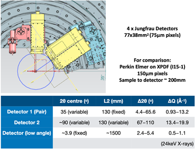
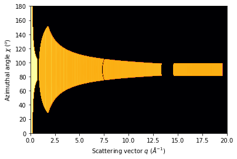
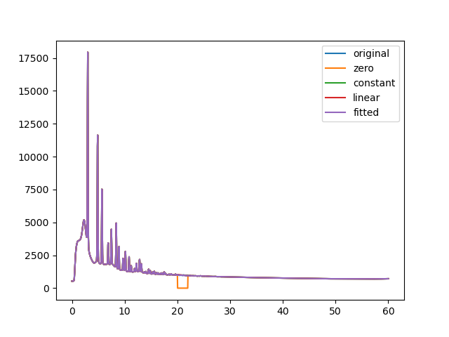
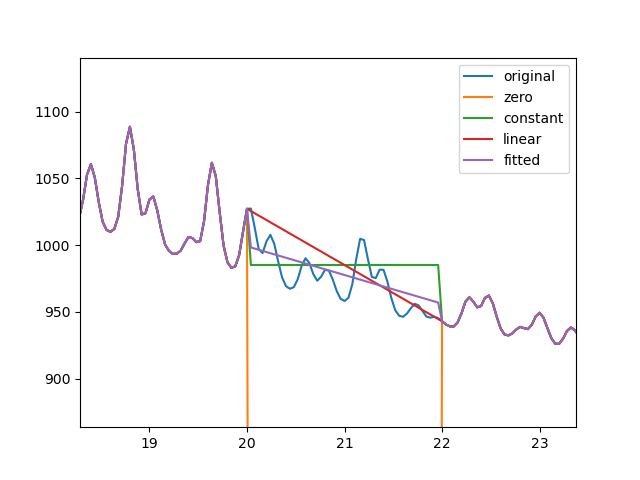
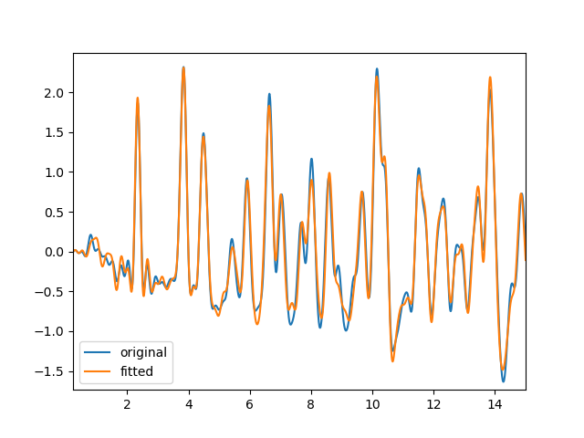

# <!--fit-->uf-TS/PDF Software Meeting 2

Dean Keeble
20th July, 2023

---
## Agenda
1. Welcome
2. Review of previous meeting
3. Update from Dean
4. Discussion of sample database options
5. Pre-visit computer access
6. November experiment logistics
7. AOB

---
## Review of Previous Meeting - Actions
1. Collect a blank data collection into our pre-visit session so that we can familiarise ourselves with the offline file formats (Karen + HED team)
2. :white_check_mark: Finalise the design of the detector geometry and distribute the drawings when available (Karen + HED team)
3. :white_check_mark: Build a multigeometry in pyfai to simulate data according to the finalised drawings (Phil)
---
4. :pause_button: Define the dependencies required in a python environment for it to be useable within EXtra-metro (Thomas, Luca?)
5. :pause_button: Confirm an environment can be built which contains both pyFAI and PDFgetX3 and the deps specified above (Dean)
6. :white_check_mark: Confirm the impact that "gaps" have on PDFgetX3: what value should they take? can they be masked? what impact should we expect? (Dean)
---
7. :white_check_mark: Is it possible to do a better job mitigating the characteristic features seen close to gaps with data which are not azimuthally symmetric? (Dean)
8. :white_check_mark: It was mentioned that DAMNIT runs on SQLite, meaning we can't write from EXtra-metro processing but we can read. Draw out a data schematic for the various collections we'll use (Dean)
9. Convert these schematics to toy/psuedo context files (Dean)
---

## Update from Dean
- Gaps & detector geometry
- Overall schematic and context files
- Gap mitigation

---

### PDFGetX3 and detector gaps

 

---
  

<!-- _footer: "gap is roughly 13.5 - 14.8" -->
---

___Does anyone have any concerns about this approach?___

---
### Overall schematic and context files
Following the example online, we have schematics for our two types of data collection
    

---

#### Points to note 1: 
- _calibration_ at EuXFEL is the process of taking the raw signal from the detector and making an image out of it
  - :arrow_right: I will endeavour (and probably fail) to refer to pyfai geometry calibration as _geometry calibration_
- we don't need to worry about _calibration_
---

#### Points to note 2: 
- EuXFEL have _online_ and _offline_ processing
- Online processing is performed on streams of data on the ONC cluster within seconds 
  - ONC cluster has no access to internet
  - Proposal directory _is_ mounted on ONC
- Offline processing is performed on data saved to disk and takes place ~15 minutes after the data collection

---
### Summary of the schematics
- We'll be able to see 1D scattering data within seconds as we can do this online
- Currently the DA team are proposing we perform the PDFGetX3 step _offline_
___How critical is instantaneous PDFGetX3-ing?___

---
## Gap mitigation
This is where the signal is not azimuthally symmetric, and a sudden radial change in the range of contributing pixels leads to discontinuities in the integrated signal
- More of an issue with large azimuthal coverage
- More soluable issue with large azimuthal coverage

---
## Database Options
For anything to happen automatically, we need some metadata about the sample: 
- Composition (so we can pipe this in to PDFGetX3)
- Substrate (so we can figure out which run to use as a background)
---
## Database Options
Various solutions we can look at
- emailing of sample info to nominated person  
- shared google spreadsheet
- a simple web app with a database backend
___Thoughts, suggestions, alternatives?___

---
## Pre-visit computer access
Typically users get access to computer system 1 month before visit, but this can be increased for specific users upon request
___Who wants to be added to this list?___

---
## November experiment logistics
- Monday 13th November - on-site preparation begins
- Thursday 16th November - set up and alignment
- Friday 17th November - experiment begins
___Who from this group plans to attend?___

---
## Any Other Business

